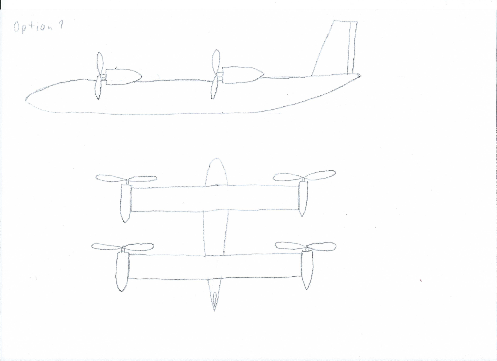

# UAV

## Goal

TBD

## Design

### Concepts

#### Tandem Wing
  - Two identical wings are used.
  - One motor on each wing tip.
  - The whole wings are tilted to transition between vertical and horizontal flight.
  - Advantages:
    - Easier calculation of the centre of gravity.
    - Tandem configurations are less susceptible to shifts of the centre of gravity.
  - Disadvantages:
    - Complex mounting of the wings.
    - Worse aerodynamics for the horizontal flight due to the smaller wingspan.
    - Aerodynamic interactions between both wings.
    - Elevator input has to be mixed into the aft wing pitch angle.

#### Conventional Wing
  - Conventional configuration supplemented by four tilting rotors.
  - Advantages:
    - Less complex wing design.
    - Better aerodynamics for the horizontal flight due to the larger wingspan.
    - Easier adjustment of the flight characteristics due to the separate elevator.
    - Wing design independent of the engines (e.g. change of the engine location during transition due to dihedral).
  - Disadvantages:
    - More difficult to calculate the centre of gravity due to the moment arm of the empennage.
    - More susceptible to changes in the centre of gravity.

### Aerodynamics

TBD

### Electronics

TBD

### Firmware

TBD

### Control Infrastructure

TBD

### Weight Calculation

TBD

## Design Considerations

### Configuration

TBD

### Suitable Parts

- Altimeter: MS5611
- Gyro/accelerometer: MPU6050
- Servos: SG90 (weight 9g)?

## Various Additional Resources

- The PX4 autopilot supports various VTOL configurations: https://docs.px4.io/v1.9.0/en/frames_vtol/
- Two MS5611 sensors can be combined to create an airspeed sensor: http://blueflyvario.blogspot.com/2013/06/air-speed-from-two-ms5611.html

  There are airspeed sensors available that build on the same chip, but just provide a better enclosure with proper hose connections, at much higher prices (e.g., MS4525DO).
- How to build a cool & cheap 3D printed micro drone: https://blog.prusaprinters.org/how-to-build-a-3d-printed-micro-drone_29310/
